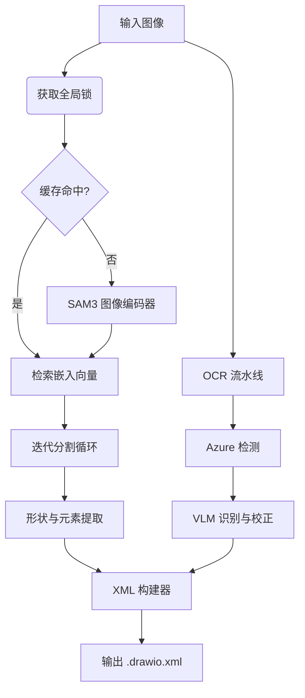

# 技术报告：图像到 DrawIO (MXGraph XML) 转换系统

## 1. 执行摘要

本系统实现了将光栅图像（JPG、PNG 格式的流程图、技术图表）转换为可编辑的矢量图形（DrawIO XML）。它克服了传统 OCR 和简单边缘检测的局限性，通过集成**最先进的视觉模型 (SAM 3)** 进行分割和 **多模态大语言模型 (Image VLM)** 进行语义理解与文本校正，从而实现了高保真的还原。

## 2. 系统架构

处理流程包含三个主要阶段：**分割**、**文本提取** 和 **集成**。

### 2.1 核心组件

*   **分割引擎**: SAM 3 (Segment Anything Model 3)。
*   **OCR 引擎**: 混合模式 (Azure Document Intelligence + Qwen/Mistral VLM)。
*   **背景移除**: RMBG-2.0 (基于 Bi-RefNet)。
*   **编排与调度**: Python (FastAPI + Asyncio) 配合线程级全局锁 (Global Locking)。

## 3. 关键算法创新

### 3.1 迭代式 VLM 引导分割
本系统不依赖于固定的提示词集合，而是使用反馈循环机制：
1.  **第一轮**: SAM3 使用通用提示词（`rectangle` 矩形, `icon` 图标, `arrow` 箭头）分割对象。
2.  **可视化**: 生成掩码 (Mask) 覆盖图，展示已检测到的内容。
3.  **VLM 推理**: 多模态大模型观察可视化图和原图，识别“遗漏”的区域。
4.  **生成提示词**: VLM 建议新的具体提示词（例如 `cylinder` 圆柱体, `actor` 参与者）。
5.  **增量解码**: SAM3 利用缓存的图像嵌入向量，仅对新提示词进行解码，并通过 NMS (非极大值抑制) 合并结果。

### 3.2 带幻觉控制的混合 OCR (Hybrid OCR)
纯 VLM OCR 经常会“产生幻觉”，例如输出处理指令而非文本内容，或读取裁剪框外的文本。而纯 Azure OCR 在处理 LaTeX 公式时表现不佳。
**解决方案**:
1.  **检测**: 使用 Azure 提供精确的文本边界框 (Bounding Boxes)。
2.  **提示注入 (Hint Injection)**: 将 Azure 检测到的文本作为“提示”传入 VLM 的系统提示词中：*“提示：文本内容可能接近于 'detected_text'。仅在必要时进行修正。”*
3.  **约束**: 这锚定了 VLM 的生成过程，使其在修正错别字或格式化 LaTeX 时不会凭空捏造内容。

### 3.3 速率限制管理 ("429" 解决方案)
处理包含 50+ 个文本块的图表时，会瞬间触发 API 速率限制。
**优化策略**:
*   **批处理**: 将裁剪后的文本图像分为每组 5 个的批次。
*   **指数退避 (Exponential Backoff)**: 如果遇到 429 错误，线程将休眠 $2^n \times 2$ 秒。
*   **配速 (Pacing)**: 在批次之间增加基础延迟（3秒），以平滑请求曲线。

### 3.4 智能颜色提取
简单的部分像素平均法在处理带边框或噪点的元素时会失效。
**算法**:
1.  **描边色 (Stroke Color)**: 分析边界框外围 10% 的边缘区域。计算这些像素的亮度，取**最暗的 25%** 像素的平均值（假设边框通常比背景深）。
2.  **填充色 (Fill Color)**: 将感兴趣区域 (ROI) 向内收缩 20% 以排除边框，计算**中值 (Median)** 像素值（比均值更能抵抗噪点和文字干扰）。

### 3.5 高保真箭头路由
图表中的箭头通常带有弯曲或虚线样式，很难完美矢量化。
**方法**: 我们将箭头作为**透明图片**提取，而不是矢量路径。
1.  **裁剪**: 裁剪箭头周围带填充 (Padding) 的区域。
2.  **掩码过滤**: 使用 SAM3 掩码将裁剪图中属于邻近元素（如文字、其他形状）的部分“涂白”。
3.  **RMBG**: 移除白色背景，仅保留箭头本身。
这确保了视觉表现与原图 100% 一致。

## 4. 性能优化

*   **SAM3 的 LRU 缓存**: 高分辨率图像编码非常耗时。我们在 `OrderedDict` (大小=3) 中缓存 `ImageEmbedding` 张量。在最近编辑的图像之间切换是瞬时的。
*   **并发控制**: 使用 `threading.Lock` 包装所有 GPU 操作。这允许 HTTP 服务器接受并发请求，而不会在单 GPU 上发生 OOM (内存溢出) 崩溃。

## 5. 部署与配置

系统采用模块化设计。
*   **配置**: `config/config.yaml` 控制模型路径和提示词。
*   **环境**: `.env` 处理密钥和敏感信息。
*   **前端**: 基于 React，允许用户上传、处理，并在嵌入式 DrawIO 编辑器中即时查看结果。

---
*Generated by GitHub Copilot on 2026-01-16*
